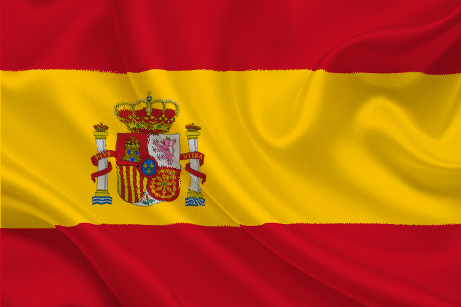
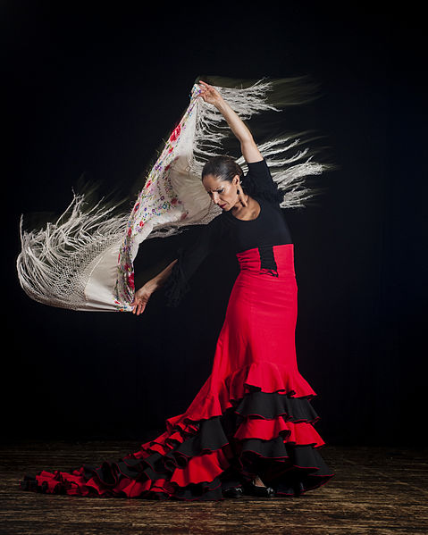
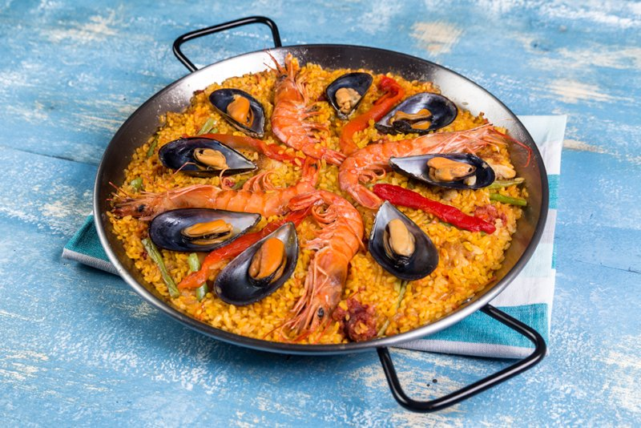

<h1>Spanish Culture</h1>

Here are some images depicting Spanish Culture.

  

    

      <a href="images/Spain.jpg">
        
        

          
The Spanish flag.

        

      </a>
    

  

  

    

      <a href="images/Flamenco.jpg">
        
        

          
A traditional dance in Spain.

        

      </a>
    

  

  

    

      <a href="images/Paella.jpg">
        
        

          
Traditional Spannish food made of rice, seafood and saffron.

        

      </a>
    

  

